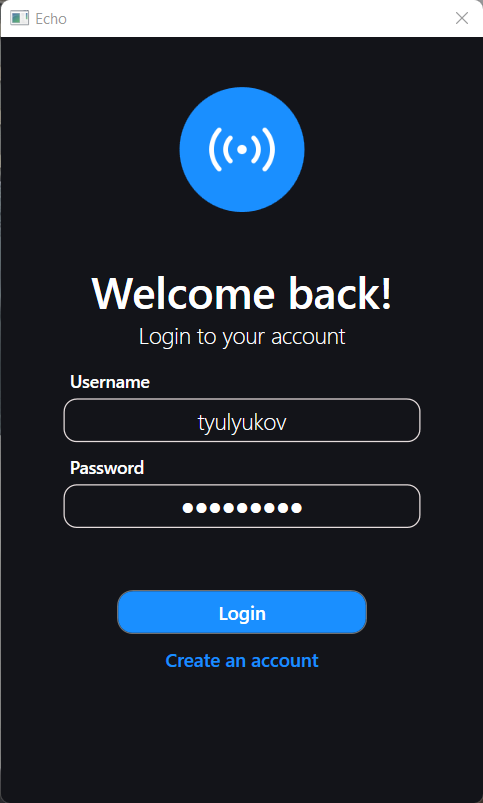
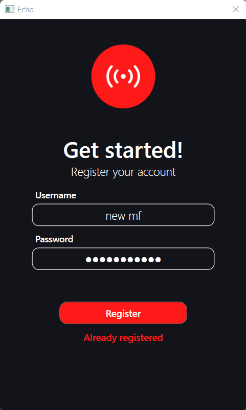

# Echo
A simple chat app called ```Echo``` based on WPF .NET 6 and Google Firebase. EXTRATHICK fluid design </3 <br><br>
## Features
- authorization, registration, remembering in registry keys user's account
- password hashing in Google Firebase Realtime Database, storaging avatars in Google Firebase Storage
- settings, changing username, avatar and password
- u can search any user in search tab
- chat history, messages loading while scrolling up
- chatting with any user. 

#### hey look at this

<span>


</span>


